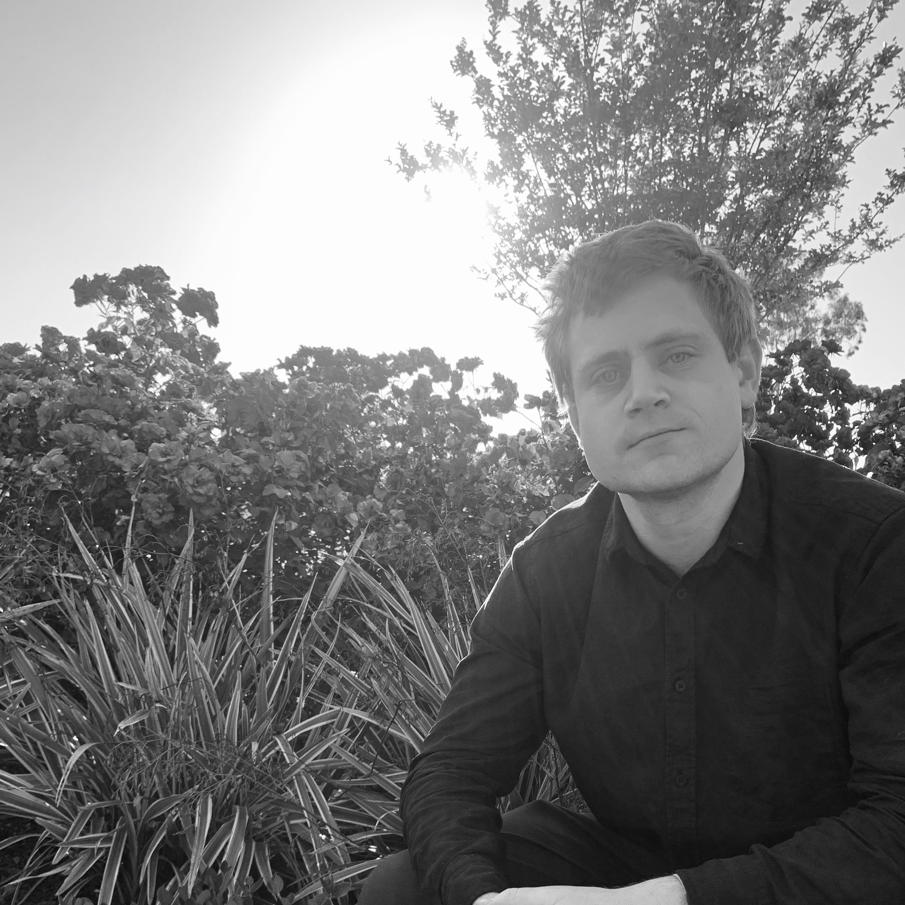

  
  

    Matthew McLaughlin
    <i>Computer science tutor</i>
    ✉️
    <a href = "mailto:matthedm@uci.edu">
      matthedm@uci.edu
    </a>
    
    <a href ="https://github.com/mdm508">💻Github</a>
  

## About me
In 2018, I graduated with my B.S in Computer Science
from the University of California Irvine. During my school years, I 
tutored the introductory python series for the freshman class.  I have taught
for Girls Who Code and the Coder School in Irvine. Since 2020 I have offered
private tutoring via zoom. 

## Goals
1) Develop problem solving skills
2) Foster good study habits
3) Empower them to conceptualize problems and solve them with code
4) Have fun and keep the lessons interesting to the student

## Languages I have taught in the past
- Racket dialect called [Begginer Student
  Language](https://docs.racket-lang.org/htdp-langs/beginner.html)
- Python
- C++
- Java ( I have helped students prepare for A.P Computer Science)
- Javascript
- Scratch

If there is a language not listed here that you want to learn just let me
know. I tend to prefer using a pedalogical language based of Racket called 
[BSL](https://htdp.org/2022-8-7/Book/part_preface.html#%28part._drtl%29). 

### Recent posts
