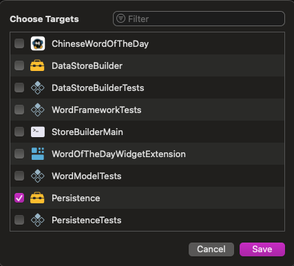
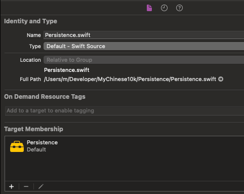

## March 31 - April 6

### Monday
- Today I spent over 10 hours helping Yush plan a trip to Kyoto. 
- I created a custom google map to help reccomend interesting places based on what district she's in. 
- Turns out Kyoto has over 1600 temples![^1]

### Tuesday 
I’ve been faithfully following my 4am, albeit insane, wake-up routine—but today, I needed a nap. The nap went on too long I actually felt more tired afterward. 

### Wednesday
- I went to the gym in the morning after meditation. I got there at 6am and still couldn't get a prime parking spot. 
- I'm still procrastinating on iOS but I realized why `PersistenceController` was not being seen by my main app; I simply forgot to mark each of the files inside the `Persistence` framework as members of the `Persistence` target. I had assumed placing the files inside the framework`s folder was enough. Turns out you need to explicitally mark the source file as a member of the target.

 

### Thursday 

### Friday 

### Saturday

### Sunday

[^1]: *List of Buddhist temples in Kyoto Prefecture*, 
[https://en.wikipedia.org/wiki/List_of_Buddhist_temples_in_Kyoto_Prefecture](https://en.wikipedia.org/wiki/List_of_Buddhist_temples_in_Kyoto_Prefecture)